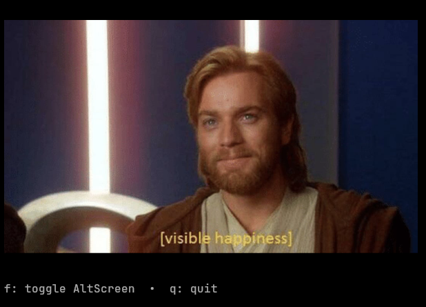

# bubblekitten

A component for  displaying images in [Bubble Tea](https://github.com/charmbracelet/bubbletea) v2 programs via the [Kitty terminal graphics
protocol](https://sw.kovidgoyal.net/kitty/graphics-protocol/), built to work under `AltScreen`.

<p align="center">
  
</p>

## What for

Drawing Kitty-protocol (`kitten icat`-style) images by writing raw
`<ESC>_G...<ESC>\` escape codes at a cursor position from inside `View()`
breaks two ways:

1. **Layout drift.** Lip Gloss / Bubble Tea's width calculators don't
   recognize Kitty APC sequences, so an embedded image blob throws off
   their character count. In `AltScreen`, where every frame redraws against
   an exact row/column grid, that drift corrupts the whole screen.
2. **Images vanish on `AltScreen`.** Per the protocol spec, switching to
   the alternate screen buffer clears all images, just like text. A naive
   integration transmits the image once, on startup, and never again — so
   entering (or re-entering) `AltScreen` wipes it out from under you.

This component avoids both:

- **The image is never drawn at a cursor position.** It's transmitted once
  as an invisible "virtual placement" (`U=1`), then *displayed* by printing
  ordinary text: the private-use rune `U+10EEEE`, with combining diacritics
  encoding which row/column tile of the image belongs in that cell, colored
  with a standard truecolor SGR foreground code that encodes the image id.
- **Pixel data goes out-of-band.** The actual chunked, base64-encoded PNG
  transmission is sent via `tea.Raw`, which writes straight to the terminal
  and bypasses the styled/measured render pipeline where the layout drift
  above happens.
- **`AltScreen` transitions trigger automatic retransmission.** Since
  Bubble Tea v2's declarative `AltScreen` can't be observed from `View()`,
  call `Model.SetAltScreen(bool)` from your `Update` wherever you flip your
  own `AltScreen` flag. The component tracks per-screen send state and
  retransmits on (re-)entering `AltScreen`, matching the spec's
  clear-on-switch behavior.
- **Resizes don't resend pixel data.** If only the display size changes,
  the component sends a cheap `a=p,U=1` placement update (new `c`/`r`) with
  no payload, rather than a full retransmit.

## Usage

```go
import (
    tea "charm.land/bubbletea/v2"
    "charm.land/lipgloss/v2"
    bubblekitten "github.com/arthursfares/bubble-kitten"
)

type model struct {
    img       bubblekitten.Model
    initCmd   tea.Cmd
    altScreen bool
}

func initialModel() model {
    // SetImage is called here, before Init runs — not inside Init itself.
    // Init can only return a tea.Cmd, not an updated Model, so mutating
    // m.img inside Init would be thrown away. The command it returns would
    // still carry the id SetImage assigned, but the live model — never
    // having been updated — would have a different id, so Update's
    // `msg.id != m.id` check would drop the decoded PNG as stale and no
    // image would ever appear.
    img, _ := loadYourImage()
    setImg, cmd := bubblekitten.New().SetImage(img)
    return model{img: setImg, initCmd: cmd}
}

func (m model) Init() tea.Cmd {
    return m.initCmd
}

func (m model) Update(msg tea.Msg) (tea.Model, tea.Cmd) {
    var cmds []tea.Cmd

    switch msg := msg.(type) {
    case tea.WindowSizeMsg:
        var cmd tea.Cmd
        m.img, cmd = m.img.SetSize(40, 20) // cells, not pixels
        cmds = append(cmds, cmd)
    case tea.KeyPressMsg:
        if msg.String() == "f" {
            m.altScreen = !m.altScreen
            var cmd tea.Cmd
            // Call this from Update, at the same point you change the
            // flag your View() will read — not from inside View() itself.
            m.img, cmd = m.img.SetAltScreen(m.altScreen)
            cmds = append(cmds, cmd)
        }
    }

    var cmd tea.Cmd
    m.img, cmd = m.img.Update(msg)
    cmds = append(cmds, cmd)
    return m, tea.Batch(cmds...)
}

func (m model) View() tea.View {
    v := tea.NewView(m.img.View())
    v.AltScreen = m.altScreen
    return v
}
```

See [`example/main.go`](example/main.go) for a complete runnable program.

## API surface

- `bubblekitten.New() Model` / `NewWithOptions(opts ...Option) Model`
- `(Model) SetImage(image.Image) (Model, tea.Cmd)` — encode + transmit a new image
- `(Model) SetSize(cols, rows int) (Model, tea.Cmd)` — display size in terminal cells
- `(Model) SetAltScreen(active bool) (Model, tea.Cmd)` — call from `Update`
- `(Model) Update(tea.Msg) (Model, tea.Cmd)` — wire into your program's `Update`
- `(Model) View() string` — plain placeholder-grid text; embed anywhere
- `(Model) Supported() bool` — whether the terminal is known not to support the protocol
- `(Model) Ready() bool` — whether the image has been transmitted and placed for the current screen context
- `(Model) Close() tea.Cmd` — free the image's terminal-side storage
- `(Model) Err() error`, `(Model) ID() uint32`
- `bubblekitten.WithSupport(Support)` — override capability auto-detection

## Things to be aware of

- **Image ids are 24-bit**, chosen randomly per `Model` to reduce collision
  risk with other programs sharing a terminal, and are not coordinated
  across multiple `Model` instances in the same program beyond that.
- The diacritics table in `diacritics_table.go` is generated from kitty's
  own canonical
  [`gen/rowcolumn-diacritics.txt`](https://github.com/kovidgoyal/kitty/blob/master/gen/rowcolumn-diacritics.txt)
  — regenerate it with `tools/gen-diacritics.sh` if you ever need to.

